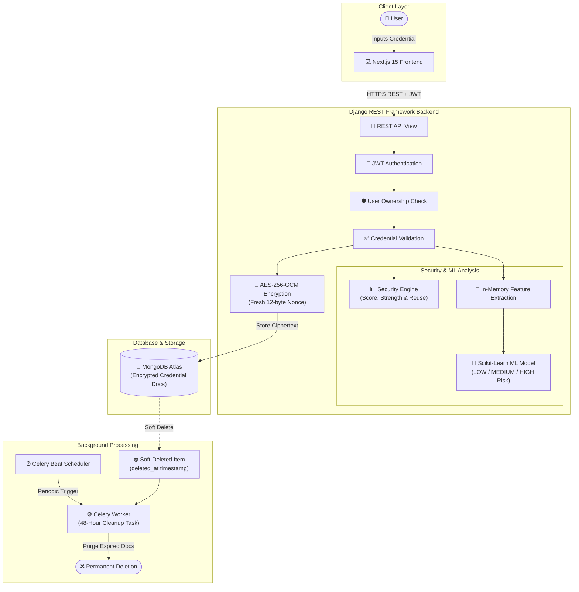

# 🔐 KeyVaultAI

### AI-Assisted Secure Password Vault

[](https://www.python.org/)
[](https://www.djangoproject.com/)
[](https://nextjs.org/)
[](https://www.typescriptlang.org/)
[](https://www.mongodb.com/atlas)
[](https://scikit-learn.org/)
[](https://pytest.org/)

KeyVaultAI is a secure, modern password manager built as a full-stack B.Tech project. It enables users to store credentials securely using authenticated server-side encryption, analyze password strength with a deterministic security engine, detect dangerous password reuse, and predict credential risk using machine learning.

---

## 📸 Screenshots

### Landing Page & Dashboard Visual Style


*The user interface is designed with a warm light glassmorphic aesthetic (`#faf8f4`), pastel sticky-note credential cards with 3D push-pin accents, and soft radiant borders.*

---

## ✨ Features

### 🔑 Authentication & Security
- **User Authentication**: Secure user registration, login, and logout.
- **Argon2id Hashing**: Account passwords hashed using OWASP-recommended parameters ($t=3$, $m=64\text{ MB}$, $p=4$) with timing-attack-safe dummy verification.
- **JWT Architecture**: Stateless 5-minute access tokens and rotating 30-day refresh tokens with JTI invalidation and revocation tracking.
- **User Isolation (IDOR / BOLA Protected)**: Server-side ownership checks derive user identity strictly from verified JWT claims. Users can never view or manipulate another user's credentials.

### 🗄️ Password Vault
- **AES-256-GCM Encryption**: Stored credentials are encrypted with authenticated symmetric AES-256-GCM using fresh 12-byte random nonces per credential.
- **Full Credential CRUD**: Add, view, edit, soft-delete, restore, and permanently delete credentials.
- **Reveal & Copy**: Decrypt passwords on demand with authenticated owner-only verification.
- **Organization**: Category filtering (`General`, `Finance`, `Social`, `Work`, etc.), favorites toggle, and private notes.
- **Safe Search**: Instant search across non-sensitive metadata (`website_name`, `username`, `email`) with regex escaping.
- **Client-Side Validation**: Pre-submission email validation to prevent invalid network requests.

### 🛡️ Security Analysis (Deterministic Engine)
- **Password Strength Scoring**: Real-time evaluation (0–100) assessing length, diversity, character sets, and sequential patterns.
- **Classification**: Categorizes passwords into `Weak`, `Fair`, `Strong`, and `Very Strong`.
- **Reuse Detection**: Identifies duplicated passwords across a user's vault in-memory using ephemeral SHA-256 hashes (hashes are discarded immediately).

### 🤖 Machine Learning Engine
- **Vulnerability Risk Prediction**: Scikit-learn classification pipeline (`StandardScaler` + `LogisticRegression`) trained on synthetic security data.
- **Risk Classification**: Classifies passwords into `LOW`, `MEDIUM`, or `HIGH` risk levels.
- **Confidence & Explanation**: Returns a probability score (`0.0 – 1.0`) and human-readable security advice.
- **Privacy-Preserving**: Operates strictly on 9 numerical features extracted in-memory; plaintext passwords never enter model artifacts.

### ⚙️ Background Maintenance & Performance
- **Soft Deletion & Recovery**: 72-hour restore window for soft-deleted credentials.
- **Automated Celery Cleanup**: Scheduled background task purges credentials soft-deleted for longer than 48 hours.
- **Redis Rate Limiting**: Sliding-window rate limiting on authentication and password reveal endpoints.

---

## 🔄 Application Workflow



---

## 🛠️ Tech Stack

| Layer | Technology | Purpose |
|---|---|---|
| **Frontend** | Next.js 15, React 19, TypeScript | App Router, responsive component views, static generation |
| **Styling** | Tailwind CSS 3.4, Framer Motion | Glassmorphism, radiant border effects, animations |
| **Backend** | Django 5.2, Django REST Framework | REST APIs, authentication middleware, permission checks |
| **Security** | Argon2-cffi, Cryptography (AES-256-GCM), PyJWT | Password hashing, vault encryption, JWT token management |
| **Machine Learning** | Scikit-Learn, NumPy | Numerical feature extraction & logistic regression risk model |
| **Database** | MongoDB Atlas (via PyMongo) | Cloud document store for encrypted credentials and users |
| **Cache & Broker** | Redis / Upstash Redis | Rate limiting counters, token revocation, Celery message broker |
| **Background Worker**| Celery 5.4 | Periodic 48-hour soft-deleted credential purge |

---

## 🔌 API Overview

All API endpoints are under `/api/v1/`.

| Group | Method | Endpoint | Description |
|---|---|---|---|
| **Auth** | `POST` | `/api/v1/auth/register/` | Register a new user account |
| **Auth** | `POST` | `/api/v1/auth/login/` | Login and receive access + refresh token |
| **Auth** | `POST` | `/api/v1/auth/token/refresh/` | Rotate refresh token and get a new pair |
| **Auth** | `POST` | `/api/v1/auth/logout/` | Revoke active refresh token |
| **Vault** | `GET` | `/api/v1/vault/credentials/` | List all active credentials (metadata only) |
| **Vault** | `POST` | `/api/v1/vault/credentials/` | Encrypt and store a new credential |
| **Vault** | `POST` | `/api/v1/vault/credentials/<id>/reveal/` | Decrypt and reveal password (owner only) |
| **Vault** | `POST` | `/api/v1/vault/credentials/<id>/copy/` | Decrypt password for clipboard (audited) |
| **Vault** | `POST` | `/api/v1/vault/credentials/<id>/soft-delete/` | Move credential to Recently Deleted |
| **Vault** | `POST` | `/api/v1/vault/credentials/<id>/restore/` | Restore soft-deleted credential |
| **Vault** | `DELETE`| `/api/v1/vault/credentials/<id>/permanent-delete/` | Permanently remove credential |
| **Security**| `GET` | `/api/v1/security/summary/` | Aggregate security score and health stats |
| **Security**| `GET` | `/api/v1/security/credentials/` | Detailed security metadata & reuse alerts |
| **ML** | `POST` | `/api/v1/ml/predict/` | Predict ML risk assessment (LOW/MED/HIGH) |
| **Health** | `GET` | `/api/v1/health/` | Service, database, and cache health check |

---

## 🚀 Getting Started (Local Development)

### 1. Prerequisites
- **Python**: 3.12+
- **Node.js**: 18+ or 20+
- **MongoDB Atlas**: Free cluster with your current IP allowlisted
- **Redis**: Local Docker container or Upstash Redis instance

### 2. Clone the Repository
```bash
git clone https://github.com/shubhamjrd4559-sudo/KeyVaultAI.git
cd KeyVaultAI
```

### 3. Backend Setup
```bash
cd backend
python -m venv .venv

# Activate virtual environment:
# Windows (PowerShell):
.venv\Scripts\Activate.ps1
# Linux/macOS:
source .venv/bin/activate

pip install -r requirements.txt
```

Create a `.env` file in the `backend/` directory from `.env.example`:
```ini
DJANGO_SECRET_KEY=your-dev-secret-key
JWT_SECRET_KEY=your-dev-jwt-secret-key
ENCRYPTION_KEY=your-32-byte-base64url-key
MONGODB_URI=mongodb+srv://<user>:<password>@<cluster>.mongodb.net/?retryWrites=true&w=majority
REDIS_URL=redis://localhost:6379/0
DEBUG=True
```

> **Tip**: Generate keys easily in Python:
> ```python
> import secrets, os, base64
> print("JWT/DJANGO:", secrets.token_urlsafe(64))
> print("ENCRYPTION_KEY:", base64.urlsafe_b64encode(os.urandom(32)).decode())
> ```

Verify setup and run the Django backend:
```bash
python manage.py check
python manage.py runserver 127.0.0.1:8000
```

### 4. Frontend Setup
In a new terminal:
```bash
cd frontend
npm install
npm run dev
```
Open [http://localhost:3000](http://localhost:3000) to view the application.

### 5. Running Background Workers (Optional)
To test the 48-hour automated cleanup task locally:
```bash
# In backend directory with .venv active:
celery -A config worker --loglevel=INFO
celery -A config beat --loglevel=INFO
```

---

## 🧪 Testing & Verification

The project includes unit, integration, and security isolation tests:

- **Backend Pytest Suite**: **233 passed / 0 failed**
  - **Vault & Encryption (`apps/vault/`)**: 75 tests (AES-256-GCM roundtrips, tampering rejection, fresh nonces, 48h cleanup)
  - **User Isolation (IDOR/BOLA)**: **33 dedicated tests** proving cross-user access is denied under all tampering scenarios
  - **Machine Learning Engine (`apps/ml_engine/`)**: 72 tests (feature extraction, LogisticRegression predictions, plaintext non-disclosure)
  - **Security Engine (`apps/security/`)**: 46 tests (deterministic scoring, character variety, in-memory reuse detection)
  - **Authentication (`apps/users/`)**: 40 tests (Argon2id hashing, timing attack safety, token rotation/revocation)
- **Django System Check**: 0 issues identified
- **Frontend Typecheck (`npx tsc --noEmit`)**: 0 errors
- **Frontend Production Build (`next build`)**: Compiled successfully

Run backend tests:
```bash
cd backend
pytest -v
```

---

## 🌐 Deployment Plan

### Current Local Development
- **Frontend**: Local Next.js dev server on port `3000`
- **Backend**: Local Django dev server on port `8000`
- **Database**: MongoDB Atlas (cloud cluster)
- **Cache/Broker**: Upstash Redis (cloud) or local Docker Redis

### Planned Production Deployment
> *KeyVaultAI is currently run in development mode. Cloud production deployment is planned for Milestone 10.*

- **Frontend**: **Vercel** *(Planned)*
- **Backend**: **Railway** *(Planned, with Gunicorn WSGI)*
- **Celery Worker & Beat**: **Railway** *(Planned background services)*
- **Database**: **MongoDB Atlas** *(Configured for Dev / Planned for Prod)*
- **Cache & Broker**: **Upstash Redis** *(Configured for Dev / Planned for Prod)*

---

## 🗺️ Project Milestones

- [x] **Milestone 0**: Repository setup, architecture planning, Docker Compose
- [x] **Milestone 1**: Django REST Framework baseline & health probes
- [x] **Milestone 2**: Authentication (Argon2id, JWT rotation, audit logging, rate limiting)
- [x] **Milestone 3**: Secure Vault (AES-256-GCM encryption, repositories, soft delete, Celery 48h purge)
- [x] **Milestone 4**: Frontend Integration (Next.js 15, sticky-notes UI, radiant borders, auth modal)
- [x] **Milestone 5**: Security Engine (Deterministic scoring, strength levels, in-memory reuse detection)
- [x] **Milestone 6**: Machine Learning Engine (Scikit-Learn LogisticRegression, risk prediction, privacy guarantees)
- [ ] **Milestone 7**: NVIDIA NIM / AI Layer *(Planned)*
- [ ] **Milestone 8**: Browser Extension for Chrome/Firefox *(Planned)*
- [ ] **Milestone 9**: Full Ecosystem Integration *(Planned)*
- [ ] **Milestone 10**: Production Cloud Hardening *(Planned)*

---

## ⚠️ Known Limitations

- **Email Infrastructure**: Password reset and email verification views are currently scaffolded stubs (`HTTP 503`) awaiting an email delivery service.
- **Token Storage**: JWT tokens are stored in `sessionStorage`. Migration to `HttpOnly; Secure; SameSite=Strict` cookies is planned.
- **Background Cleanup**: The automated 48-hour purge requires Celery Worker and Beat processes to be actively running.
- **Free-Trial Limits**: Free-trial storage and credential quotas are configurable and will be finalized after architecture review *(Status: Planned)*.

---

## 📜 License & Author

- **Author**: Developed by **SK (Shubham Kumar)** — B.Tech Project.
- **License**: Not yet specified.
