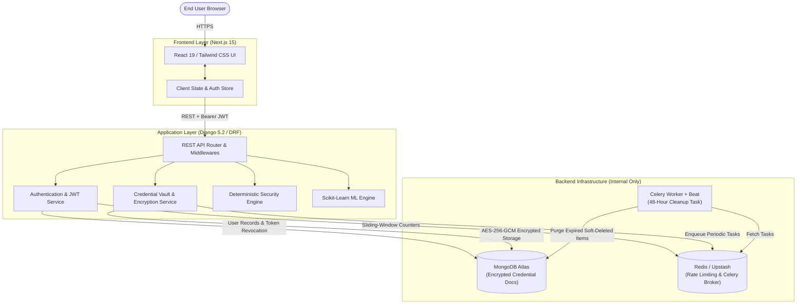
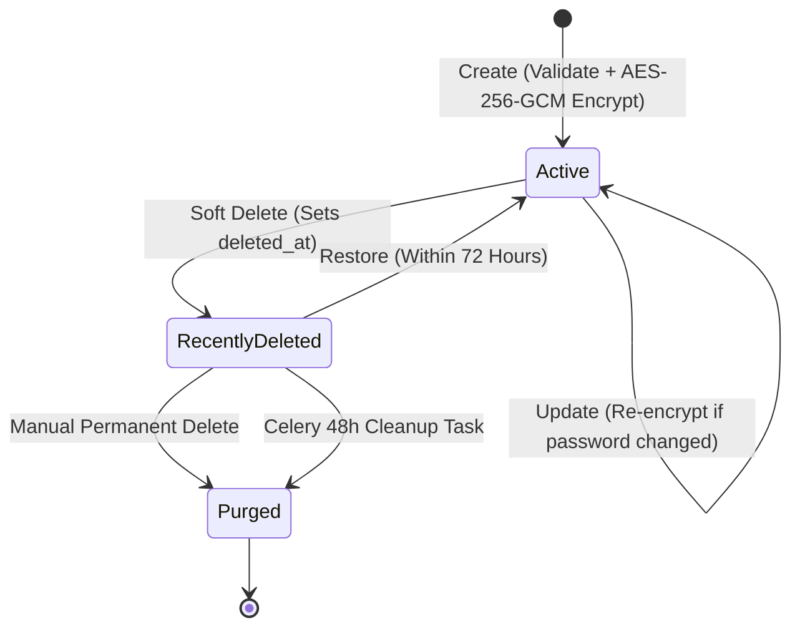
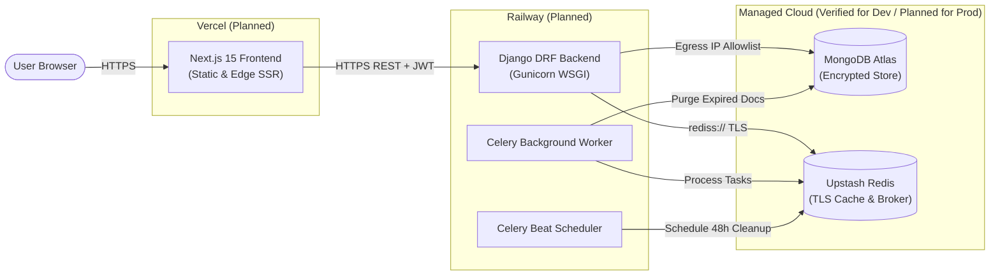

# KeyVaultAI

**Intelligent, server-side encrypted credential vault with deterministic security analysis and machine learning risk prediction.**

KeyVaultAI is a secure, AI-assisted password management platform engineered to protect sensitive credentials using authenticated server-side encryption while providing deterministic password vulnerability analysis, machine-learning-based risk prediction, and a modern, high-aesthetic vault management interface.

---

## Table of Contents

- [Overview](#overview)
- [Core Features](#core-features)
  - [Currently Implemented](#currently-implemented)
  - [Planned Features](#planned-features)
- [Screenshots & UI Preview](#screenshots--ui-preview)
- [System Architecture](#system-architecture)
- [Security Architecture](#security-architecture)
  - [Account Password Security](#account-password-security)
  - [Vault Encryption](#vault-encryption)
  - [Authentication & Token Lifecycle](#authentication--token-lifecycle)
  - [Authorization & IDOR / BOLA Prevention](#authorization--idor--bola-prevention)
  - [Data Flow Boundary](#data-flow-boundary)
- [Vault Lifecycle](#vault-lifecycle)
- [Security Engine & Machine Learning](#security-engine--machine-learning)
  - [Deterministic Security Engine](#deterministic-security-engine)
  - [Scikit-Learn Machine Learning Engine](#scikit-learn-machine-learning-engine)
- [Technology Stack](#technology-stack)
- [API Overview](#api-overview)
- [Project Structure](#project-structure)
- [Local Development Setup](#local-development-setup)
- [Environment Variables](#environment-variables)
- [Testing & Verification](#testing--verification)
- [Security & Privacy Notes](#security--privacy-notes)
- [Free Trial & Resource Policy](#free-trial--resource-policy)
- [Roadmap & Milestones](#roadmap--milestones)
- [Future Security Hardening Checklist](#future-security-hardening-checklist)
- [Future Product Roadmap](#future-product-roadmap)
- [Deployment Architecture](#deployment-architecture)
  - [Current Local Development Infrastructure](#current-local-development-infrastructure)
  - [Planned Production Architecture](#planned-production-architecture)
- [Production Readiness Checklist](#production-readiness-checklist)
- [Known Limitations](#known-limitations)
- [Contributing](#contributing)
- [License](#license)
- [Author & Acknowledgements](#author--acknowledgements)

---

## Overview

Modern digital security requires managing dozens of distinct, high-entropy passwords across diverse services. When users rely on memory or insecure notes, weak passwords and dangerous password reuse become common failure points.

KeyVaultAI bridges the gap between cryptographic security and intuitive user experience:

- **Server-Side Authenticated Encryption**: Credentials are encrypted before persistence using AES-256-GCM. Plaintext passwords never touch database disks, logs, or cache stores.
- **Deterministic Vulnerability Analysis**: A local, zero-side-effect security engine analyzes password entropy, complexity, and user-scoped reuse patterns without exposing secrets.
- **Machine Learning Risk Assessment**: A lightweight machine learning pipeline evaluates credential risk patterns based on numerical features extracted in-memory, without storing plaintext data in model artifacts.
- **Warm Glassmorphic Interface**: A light-themed UI styled with soft ivory, pastel sticky-note cards, and radiant light borders replaces generic tables with an engaging visual experience.

---

## Core Features

### Currently Implemented

- **Account Authentication**:
  - User registration and login with strict validation.
  - Argon2id account password hashing adhering to OWASP guidelines.
  - Timing-attack-resistant authentication flow with pre-computed dummy verification.
  - Stateless JSON Web Token (JWT) architecture with short-lived access tokens (5 minutes) and rotating refresh tokens (30 days).
  - Single-use refresh token rotation with JTI invalidation and MongoDB revocation storage.
- **Vault & Credential Management**:
  - Complete CRUD operations: create, read, update, soft-delete, restore, and permanently delete credentials.
  - Authenticated symmetric AES-256-GCM encryption with fresh 12-byte random nonces generated per credential.
  - Server-side IDOR / BOLA ownership validation derived exclusively from authenticated JWT claims.
  - Categorization (`General`, `Social`, `Finance`, `Work`, `Shopping`, `Entertainment`, `Education`, `Other`).
  - Favorites toggle and private notes storage.
  - Fast client-side and server-side search across non-sensitive metadata (`website_name`, `username`, `email`, `website_url`) with regex escaping.
  - Pre-submission client-side validation ensuring valid email formatting and preventing unauthorized submissions.
- **Security & Analytics Engine**:
  - Deterministic password scoring (0–100) and categorization into four levels (`Weak`, `Fair`, `Strong`, `Very Strong`).
  - In-memory credential reuse detection using ephemeral SHA-256 hashes discarded immediately after calculation.
  - Security summary endpoint reporting vulnerability counts and aggregate vault health.
- **Machine Learning Engine**:
  - Scikit-learn classification pipeline (`StandardScaler` + `LogisticRegression`) trained reproducibly on synthetic datasets.
  - In-memory feature extraction computing numeric entropy and pattern signals without logging passwords.
  - Outputs 3-class risk assessments (`LOW`, `MEDIUM`, `HIGH`) with confidence percentages and human-readable explanations.
- **Background Cleanup Architecture**:
  - Soft-deletion lifecycle storing `deleted_at` timestamps for 72-hour recovery.
  - Celery periodic task (`apps.vault.tasks.cleanup_expired_deleted_credentials`) configured to purge records soft-deleted for more than 48 hours.
- **Rate Limiting & Audit Trail**:
  - Redis sliding-window rate limiters on sensitive auth and reveal/copy endpoints.
  - Structured audit logging tracking security actions (`login`, `logout`, `credential_created`, `credential_revealed`, etc.) without recording sensitive credentials.

### Planned Features

- Zero-knowledge client-side encryption option (passwords encrypted in-browser before transmission).
- Automatic clipboard-clearing and password re-masking timers (30 seconds).
- Email verification and secure password reset workflows.
- Migration of refresh tokens from client storage to `HttpOnly; Secure; SameSite=Strict` cookies.
- Browser extensions for autofill and credential capture.
- Configurable free-trial quota enforcement.

---

## Screenshots & UI Preview

KeyVaultAI features a cohesive light-themed aesthetic built with soft cream tones, pastel sticky cards, and subtle radiant light borders.

### Landing Page
*Reference: `Landing Page / Hero View`*
- **Visual Atmosphere**: Warm light background (`#faf8f4`) layered with a fine geometric grid and radial ambient light.
- **Sticky Note Wall**: Background cards (Instagram, Telegram, Amazon, LinkedIn, Netflix, Google Mail, Dropbox, Facebook, CodeChef, Reddit, LeetCode) styled as pastel sticky notes with masked password indicators (`Password :– •••••••••`).
- **Hero Card**: Centered glassmorphic card with a soft pink glow, featuring `AI PASSWORD VAULT (by SK)`.
- **Action Bar**: Balanced floating action bar with radiant golden/white luminous borders housing primary calls-to-action: **GET STARTED** and **REGISTER NOW**.

### Authentication
*Reference: `Login / Modal View`*
- **Modal Dialogue**: Glassmorphic modal with a radiant border over a backdrop-blurred landing view.
- **Form Interface**: Clean input fields for email and password with crisp validation feedback.
- **Primary Action**: Gradient CTA button (**Unlock Vault**) and navigation links between Login and Registration.

### Vault Dashboard
*Reference: `Authenticated Dashboard View`*
- **Header**: Persistent navigation with KeyVault-AI branding and one-click session sign-out.
- **Credential Creator (Left Column)**: Dedicated glassmorphic form for adding credentials, including website name, URL, username, email (with real-time format validation), password, category selector, private notes, and favorite toggle.
- **Security Analysis (Left Column)**: Real-time deterministic analysis panel displaying overall score, credential health metrics, and ML risk evaluation.
- **Vault Grid (Right Column)**:
  - Top search bar and category filter.
  - Credential sticky cards rendered in pastel yellow, blush pink, sky blue, and mint green with realistic decorative push pins.
  - Interactive controls per card: reveal password (eye icon), copy to clipboard, inline metadata edit, and trash/delete.

---

## System Architecture

KeyVaultAI separates user-facing presentation, application business logic, cryptographic boundaries, and persistence services:



### Architectural Responsibilities

1. **Frontend (Next.js 15)**:
   - Client-side rendering, input validation, token persistence, and responsive UI.
   - Communicates exclusively via HTTPS REST calls to the Django API.
   - **Never connects directly to MongoDB, Redis, or Celery.**
2. **Backend (Django / DRF)**:
   - Enforces authentication, server-side ownership checks, business logic, rate limits, and audit trails.
   - Hosts the cryptographic boundary (Argon2id and AES-256-GCM).
3. **Database (MongoDB Atlas)**:
   - Stores user profiles, token revocation metadata, and encrypted credential records.
   - Completely private behind the backend server network allowlist.
4. **Cache & Broker (Redis / Upstash)**:
   - Stores rate-limiting counters and acts as the message broker for Celery background tasks.
5. **Worker (Celery Worker & Beat)**:
   - Executes background maintenance, including periodic 48-hour permanent cleanup of soft-deleted items.

---

## Security Architecture

### Account Password Security
- **Algorithm**: Argon2id via `argon2-cffi`.
- **Parameters**: `time_cost=3`, `memory_cost=65536` (64 MB), `parallelism=4`, `hash_len=32`, `salt_len=16` (exceeds OWASP minimum recommendations).
- **Timing Attack Mitigation**: When authentication queries fail to locate a user email, the service runs a constant-time dummy verification against a pre-computed Argon2id hash to prevent username enumeration via response-time discrepancy.
- Plaintext account passwords are never persisted, cached, or logged.

### Vault Encryption
- **Algorithm**: Authenticated symmetric AES-256-GCM using `cryptography.hazmat.primitives.ciphers.aead.AESGCM`.
- **Nonce Generation**: Every encryption generates a fresh, cryptographically random 12-byte nonce via `os.urandom(12)`. Nonces are never reused.
- **Integrity Verification**: GCM computes a 16-byte authentication tag. Any tampering with ciphertext immediately raises `InvalidTag` and fails closed.
- **Key Requirement**: Exactly 32 bytes (256 bits), supplied via base64url encoding.
- **Storage Structure**: Encrypted fields are stored as `base64url(nonce ‖ ciphertext ‖ tag)`.
- **Access Projection**: Standard credential queries (`list`, `retrieve`) project metadata only, strictly excluding `encrypted_password`. Ciphertext is retrieved solely during explicit owner-authorized reveal, copy, or feature extraction operations.

### Authentication & Token Lifecycle
- **Access Tokens**: Short-lived (5 minutes), containing user ID and email. Verified cryptographically via HMAC-SHA256.
- **Refresh Tokens**: Long-lived (30 days), containing a unique token ID (`jti`) and user ID.
- **Token Rotation**: Using a refresh token issues a brand-new token pair and marks the previous refresh token `jti` revoked in MongoDB.
- **Revocation Check**: The backend verifies token `jti` revocation status on refresh and logout calls.

### Authorization & IDOR / BOLA Prevention
- Every vault operation (`GET`, `POST`, `PATCH`, `DELETE`, `reveal`, `copy`, `restore`, `permanent-delete`) extracts the user identity directly from the authenticated JWT token context (`request.user.user_id`).
- All repository lookups require both `credential_id` and `user_id` (`find_by_id_and_user`).
- Accessing a credential belonging to another user raises `CredentialNotFoundError` and returns an ambiguous HTTP 404, preventing resource enumeration and unauthorized access.
- Validated through **33 dedicated IDOR/BOLA unit tests**.

### Data Flow Boundary
```
User Input (Browser)
   ↓ (HTTPS POST / JSON)
Django API View
   ↓ (JWT AuthenticatedContext)
Ownership Verification (repo.find_by_id_and_user)
   ↓ (In-Memory Key Application)
AES-256-GCM Encryption (os.urandom(12) + AESGCM)
   ↓ (base64url ciphertext)
MongoDB Atlas (Encrypted Document on Disk)
```

---

## Vault Lifecycle

Every credential in KeyVaultAI transitions through a defined lifecycle:



1. **Creation**: User inputs credential metadata and password. The system validates fields (including client-side and server-side email verification), generates a fresh 12-byte nonce, encrypts the password with AES-256-GCM, calculates the security score, and persists the record.
2. **Read / List / Search**: Documents are returned with metadata only. Plaintext passwords are not returned.
3. **Reveal & Copy**: Requires an authenticated request with the owner's JWT. Plaintext is decrypted in memory, returned to the authorized user, and audited.
4. **Soft Delete**: Marks the record with `is_deleted = True` and records `deleted_at = datetime.now(timezone.utc)`. The credential immediately disappears from normal vault views and appears in **Recently Deleted**.
5. **Restore**: Allows the owner to restore the soft-deleted credential back to active status within the retention window.
6. **Permanent Delete**: Immediately removes the record from MongoDB.
7. **Automated Background Cleanup**: When Celery Worker and Beat are active, a scheduled task identifies records soft-deleted for longer than 48 hours and purges them permanently.

---

## Security Engine & Machine Learning

KeyVaultAI maintains a strict separation between deterministic rule-based analysis and statistical machine learning.

### Deterministic Security Engine
- **Location**: `backend/apps/security/`
- **Nature**: Pure mathematical and rule-based evaluation with zero external network requests and zero side effects.
- **Scoring Model (0–100)**:
  - Length contributions (up to 30 points).
  - Character diversity: uppercase, lowercase, numbers, special characters (up to 40 points).
  - Entropy and variety adjustments (up to 30 points).
  - Penalties for sequential characters, common repeating patterns, and dictionary similarities.
- **Classification Thresholds**:
  - `0 – 39`: Weak
  - `40 – 59`: Fair
  - `60 – 79`: Strong
  - `80 – 100`: Very Strong
- **Reuse Detection**: Computes ephemeral SHA-256 hashes of decrypted passwords in memory to identify duplicate credentials within the user's vault. Hashes are discarded immediately after calculation.

### Scikit-Learn Machine Learning Engine
- **Location**: `backend/apps/ml_engine/`
- **Model**: `scikit-learn` Pipeline combining `StandardScaler` with multi-class `LogisticRegression` (`solver="lbfgs"`, `random_state=42`).
- **Training Data**: Trained on synthetic feature distributions representing realistic password vulnerability profiles.
- **Feature Vector**: 9 numeric features extracted in-memory:
  - Password length
  - Character set counts (digits, uppercase, lowercase, special characters)
  - Character variety ratio
  - Shuffled entropy estimate
  - Existing security score
  - Reused flag (`0.0` or `1.0`)
- **Outputs**:
  - `risk_level`: `LOW` | `MEDIUM` | `HIGH`
  - `confidence`: Probability estimate in range `[0.0, 1.0]`
  - `explanation`: Safe, human-readable vulnerability summary
- **Privacy Guarantee**: Passwords and ciphertexts are never stored in model artifacts or serialization files. Feature extraction operates in memory, and the model evaluates purely numerical vectors.

---

## Technology Stack

| Layer | Technology | Purpose |
|---|---|---|
| **Frontend Framework** | Next.js 15 (App Router) | React server components, static generation, modern routing |
| **UI Library** | React 19 | Declarative user interface components |
| **Styling & Effects** | Tailwind CSS 3.4, Framer Motion | Glassmorphism, radiant light borders, micro-animations |
| **Icons** | Lucide React | Clean, lightweight interface iconography |
| **Language** | TypeScript 5.7 / Python 3.12+ | End-to-end static typing and backend safety |
| **Backend Framework** | Django 5.2 / Django REST Framework 3.15 | REST API endpoints, routing, middleware, test runner |
| **Authentication** | PyJWT, Argon2-cffi | Token issuance, rotation, OWASP-compliant password hashing |
| **Vault Encryption** | Cryptography (AES-256-GCM) | Authenticated symmetric encryption for stored secrets |
| **Primary Database** | MongoDB Atlas (via PyMongo 4.10+) | Document storage for credentials, users, and audit events |
| **Cache & Message Broker** | Redis 7.4 / Upstash Redis | Rate limiting counters, token revocation cache, Celery broker |
| **Background Processing** | Celery 5.4 | Periodic execution of 48-hour soft-delete cleanup |
| **Machine Learning** | Scikit-Learn 1.5+, NumPy | Numerical feature extraction and vulnerability prediction |
| **Containerization** | Docker, Docker Compose | Local development containerization for Redis and Celery |

---

## API Overview

All API endpoints are prefixed with `/api/v1/`. Authenticated endpoints require `Authorization: Bearer <access_token>`.

### Authentication Endpoints (`/api/v1/auth/`)
| Method | Endpoint | Description | Auth Required |
|---|---|---|---|
| `POST` | `/register/` | Register new account with name, email, and password | No |
| `POST` | `/login/` | Authenticate with credentials and receive access/refresh tokens | No |
| `POST` | `/logout/` | Revoke current refresh token and clear session | Yes |
| `POST` | `/token/refresh/` | Rotate refresh token and obtain new token pair | No |
| `POST` | `/verify-email/` | *Scaffolded endpoint (awaiting email provider)* | No |
| `POST` | `/forgot-password/`| *Scaffolded endpoint (awaiting email provider)* | No |
| `POST` | `/reset-password/` | *Scaffolded endpoint (awaiting email provider)* | No |

### Vault Endpoints (`/api/v1/vault/`)
| Method | Endpoint | Description | Auth Required |
|---|---|---|---|
| `GET` | `/credentials/` | List all active credentials for authenticated user | Yes |
| `POST` | `/credentials/` | Encrypt and store new credential | Yes |
| `GET` | `/credentials/<id>/` | Retrieve metadata for specific credential | Yes |
| `PATCH`| `/credentials/<id>/` | Update credential metadata or re-encrypt updated password | Yes |
| `POST` | `/credentials/<id>/reveal/` | Decrypt and reveal credential password | Yes |
| `POST` | `/credentials/<id>/copy/` | Decrypt password for clipboard copy (audited) | Yes |
| `POST` | `/credentials/<id>/soft-delete/` | Move credential to Recently Deleted | Yes |
| `POST` | `/credentials/<id>/restore/` | Restore soft-deleted credential to active vault | Yes |
| `DELETE`| `/credentials/<id>/permanent-delete/` | Permanently remove credential from database | Yes |
| `GET` | `/recently-deleted/` | List soft-deleted credentials within 72-hour window | Yes |

### Security & ML Endpoints
| Method | Endpoint | Description | Auth Required |
|---|---|---|---|
| `GET` | `/api/v1/security/summary/` | Aggregate vault security scores, levels, and counts | Yes |
| `GET` | `/api/v1/security/credentials/` | Detailed security metadata and reuse alerts per credential | Yes |
| `POST` | `/api/v1/ml/predict/` | Predict ML risk assessment for score or specific credential | Yes |

### Health Endpoints
| Method | Endpoint | Description | Auth Required |
|---|---|---|---|
| `GET` | `/api/v1/health/` | System status, database probe, and Redis connectivity | No |

---

## Project Structure

```
KeyVaultAI/
├── .env.example                     # Environment template with safety documentation
├── docker-compose.yml               # Local development services (Redis, Celery)
├── README.md                        # Project documentation and engineering guide
│
├── frontend/                        # Next.js 15 frontend application
│   ├── app/
│   │   ├── globals.css              # Design tokens, glassmorphism, radiant border classes
│   │   ├── layout.tsx               # Root layout and font configurations
│   │   └── page.tsx                 # Main application view (Landing vs Dashboard)
│   ├── components/
│   │   ├── AuthDialog.tsx           # Glassmorphic login / registration modal
│   │   ├── LandingHero.tsx          # Landing page with interactive sticky-notes wall
│   │   ├── SecurityPanel.tsx        # Security analysis and ML prediction dashboard widget
│   │   └── VaultDashboard.tsx       # Main vault dashboard, card grid, and creator panel
│   ├── lib/
│   │   ├── api.ts                   # Centralized API client and error handling
│   │   └── auth.ts                  # Token storage management and refresh helpers
│   ├── types/
│   │   └── index.ts                 # Shared TypeScript interfaces
│   ├── package.json                 # Frontend dependencies and build scripts
│   └── tailwind.config.ts           # Tailwind CSS configuration
│
├── backend/                         # Django 5.2 / DRF backend application
│   ├── manage.py                    # Django management entry point
│   ├── requirements.txt             # Python dependencies
│   ├── pytest.ini                   # Pytest test configuration
│   ├── config/
│   │   ├── celery.py                # Celery app initialization and beat scheduler
│   │   ├── urls.py                  # Root API route dispatcher
│   │   ├── wsgi.py / asgi.py        # Web server gateway interfaces
│   │   └── settings/
│   │       ├── base.py              # Shared Django settings and cryptographic tokens
│   │       ├── development.py       # Development overrides (CORS localhost, debug)
│   │       └── production.py        # Production hardening (HTTPS, HSTS, secure cookies)
│   └── apps/
│       ├── common/                  # Health probes and base models
│       ├── users/                   # Registration, login, Argon2id, JWT services
│       ├── vault/                   # AES-256-GCM encryption, repositories, Celery tasks
│       ├── security/                # Deterministic password analyzer and reuse engine
│       ├── ml_engine/               # Scikit-learn LogisticRegression risk model
│       └── audit/                   # Security audit event tracking
│
└── docs/                            # In-depth architectural references
    ├── api.md                       # Comprehensive API contract documentation
    ├── architecture.md              # System design and component diagrams
    ├── security.md                  # Cryptographic models and security guarantees
    └── ENVIRONMENT_VARIABLES.md     # Detailed configuration reference
```

---

## Local Development Setup

### Prerequisites
- **Python**: 3.12 or 3.13
- **Node.js**: 18.x or 20.x
- **Docker**: For running local Redis (or access to an Upstash Redis instance)
- **MongoDB Atlas**: A free cluster with your current development IP allowlisted

### 1. Clone Repository
```bash
git clone https://github.com/shubhamjrd4559-sudo/KeyVaultAI.git
cd KeyVaultAI
```

### 2. Configure Environment Variables
Copy `.env.example` to `backend/.env` (and optionally create `.env` at root for Docker):
```bash
cp backend/.env.example backend/.env
```

Generate secure development keys using Python:
```bash
# Generate DJANGO_SECRET_KEY & JWT_SECRET_KEY
python -c "import secrets; print(secrets.token_urlsafe(64))"

# Generate 32-byte base64url ENCRYPTION_KEY
python -c "import os, base64; print(base64.urlsafe_b64encode(os.urandom(32)).decode())"
```
Fill in `MONGODB_URI` pointing to your MongoDB Atlas cluster.

### 3. Backend Setup
```bash
cd backend
python -m venv .venv

# On Windows (PowerShell):
.venv\Scripts\Activate.ps1
# On Linux/macOS:
source .venv/bin/activate

pip install -r requirements.txt
```

Verify the Django environment and system checks:
```bash
python manage.py check
```

Run tests to ensure dependencies and encryption function correctly:
```bash
pytest
```

Start the Django development server:
```bash
python manage.py runserver 127.0.0.1:8000
```

### 4. Background Services (Redis & Celery)
Using Docker Compose for local Redis:
```bash
docker compose up redis -d
```

In a separate terminal, start the Celery worker and beat scheduler (with virtual environment active):
```bash
cd backend
celery -A config worker --loglevel=INFO
celery -A config beat --loglevel=INFO
```

### 5. Frontend Setup
In a new terminal window:
```bash
cd frontend
npm install
npm run dev
```

The Next.js application will run at `http://localhost:3000`, communicating with the Django backend at `http://localhost:8000`.

---

## Environment Variables

All variables should be defined in `backend/.env`. Never commit actual keys to version control.

| Variable | Purpose | Required in Dev | Required in Prod |
|---|---|---|---|
| `DJANGO_SECRET_KEY` | Core Django cryptographic signing key | Yes | Yes (Unique) |
| `DEBUG` | Enables detailed error logs and local CORS fallback | Optional (Default `True`) | Must be `False` |
| `ALLOWED_HOSTS` | Comma-separated list of valid host headers | Optional (`localhost`) | Yes |
| `JWT_SECRET_KEY` | Dedicated signing key for access/refresh tokens | Yes | Yes (Must differ from Django key) |
| `JWT_ACCESS_TOKEN_LIFETIME` | Access token lifespan in seconds (default: 300) | Optional | Optional |
| `JWT_REFRESH_TOKEN_LIFETIME` | Refresh token lifespan in seconds (default: 2592000) | Optional | Optional |
| `ENCRYPTION_KEY` | 32-byte base64url key for AES-256-GCM vault encryption | Yes | Yes (High Security) |
| `MONGODB_URI` | MongoDB connection string (Backend access only) | Yes | Yes |
| `MONGODB_DATABASE` | Database name (default: `keyvaultai`) | Optional | Optional |
| `REDIS_URL` | Redis URI for rate limiting and Celery broker | Yes | Yes (`rediss://` TLS in prod) |
| `CORS_ALLOWED_ORIGINS` | Comma-separated list of permitted frontend URLs | No (Defaults to localhost:3000) | Yes (e.g. Vercel domain) |
| `DJANGO_SETTINGS_MODULE` | Active Django configuration module | `config.settings.development` | `config.settings.production` |

---

## Testing & Verification

KeyVaultAI maintains an automated test suite verifying security invariants, cryptographic round-trips, user isolation, and API functionality.

### Current Verification Status

- **Backend Pytest Suite**: **233 passed / 0 failed**
  - **Vault & Encryption (`apps/vault/`)**: 75 tests passing (includes AES-256-GCM round-trip, tampering detection, fresh nonce verification, soft-delete, and Celery 48h cleanup).
  - **Dedicated IDOR / BOLA Isolation Tests**: **33 tests passing** (verifying that User A cannot list, view, reveal, copy, edit, delete, restore, or analyze User B's credentials under any URL parameter or request tampering).
  - **Machine Learning Engine (`apps/ml_engine/`)**: 72 tests passing (feature extraction, synthetic data generation, LogisticRegression prediction, score-based fallback, and plaintext non-disclosure verification).
  - **Security Engine (`apps/security/`)**: 46 tests passing (deterministic scoring, character entropy rules, in-memory password reuse detection).
  - **Authentication & Users (`apps/users/`)**: 40 tests passing (Argon2id hashing, timing attack mitigation, token rotation, token revocation, rate limiting).
- **Django System Check**: `System check identified no issues (0 silenced)`
- **Frontend Typecheck (`npx tsc --noEmit`)**: **0 errors / clean exit code 0**
- **Frontend Production Build (`next build`)**: **Compiled successfully / 4 static routes generated**

Run the complete test suite locally:
```bash
# In backend directory:
pytest -v

# Run dedicated isolation tests only:
pytest apps/vault/tests/test_isolation.py -v

# Run frontend type check:
cd ../frontend && npm run typecheck
```

---

## Security & Privacy Notes

- **Never Commit Secrets**: Live `.env` files are excluded by `.gitignore`. Keep your `ENCRYPTION_KEY` and `JWT_SECRET_KEY` secure.
- **Backend-Only Boundary**: MongoDB Atlas and Redis must remain strictly behind the backend application layer. End-users must never connect directly to databases or cache brokers.
- **Transport Security**: In production environments, HTTPS is mandatory to protect access tokens during transit.
- **Database IP Allowlisting**: For local development, add your development machine's public IP to MongoDB Atlas Network Access. In production, restrict database access strictly to the backend server's egress IPs.
- **Key Loss Precaution**: Because vault credentials are encrypted using AES-256-GCM with `ENCRYPTION_KEY`, losing this key will make all stored passwords permanently unrecoverable.

---

## Free Trial & Resource Policy

- **Status**: **Planned**
- **Policy Statement**: *Free-trial limits are configurable and will be finalized after the storage/quota architecture review.*

The future quota management policy will establish balanced boundaries for trial accounts to ensure service availability and prevent abuse:
- Maximum active credentials per user (e.g., 20–50 items).
- Retention window for soft-deleted credentials (currently set to 72 hours in UI and 48 hours for Celery cleanup).
- Maximum character limits on private notes and website URLs.
- User-level rate limits on credential reveal and copy operations.
- Alignment with MongoDB Atlas and Upstash Redis free-tier operational limits.

---

## Roadmap & Milestones

### Completed Milestones

- [x] **Milestone 0 — Architecture & Repository**: Clean multi-layer repository structure, documentation, Docker Compose setup, and `.env.example`.
- [x] **Milestone 1 — Backend Foundation**: Django REST Framework baseline, configuration separation (dev/prod), health probes for MongoDB and Redis, Celery setup.
- [x] **Milestone 2 — Authentication & Access**: Argon2id password hashing, constant-time dummy verify, JWT access & rotating refresh tokens, token revocation, audit service, and Redis sliding-window rate limiting.
- [x] **Milestone 3 — Secure Password Vault**: AES-256-GCM authenticated encryption service, random nonces, Credential repository, soft delete, 72h recovery, and 48h Celery automated permanent purge.
- [x] **Milestone 4 — Frontend Integration**: Next.js 15 application, responsive sticky-note UI, authentication modal, credential manager, client-side email format validation, and radiant light border styling.
- [x] **Milestone 5 — Deterministic Security Engine**: Local password entropy analyzer, score computation (0–100), strength level classification, and in-memory ephemeral hash reuse detection.
- [x] **Milestone 6 — Machine Learning Risk Engine**: Scikit-learn LogisticRegression pipeline with StandardScaler, synthetic dataset generation, in-memory feature extraction, and risk prediction without plaintext exposure.

### Planned Milestones

- [ ] **Milestone 7 — NVIDIA NIM / AI Layer** *(Planned)*: Integration of NVIDIA NIM microservices for intelligent security insights, contextual password recommendations, and advanced threat profiling.
- [ ] **Milestone 8 — Browser Extension** *(Planned)*: Lightweight Chromium/Firefox extension providing secure autofill, credential capture, and instant vault synchronization.
- [ ] **Milestone 9 — Full Ecosystem Integration** *(Planned)*: End-to-end integration between web vault, browser extension, and advanced AI evaluation services.
- [ ] **Milestone 10 — Production Hardening & Launch** *(Planned)*: Production deployment on Railway and Vercel, automated backups, HttpOnly cookie migration, and continuous security auditing.

---

## Future Security Hardening Checklist

The following hardening measures are planned for upcoming releases:

- [ ] **HttpOnly Cookie Migration**: Migrate refresh tokens from client storage (`sessionStorage`) to secure `HttpOnly; Secure; SameSite=Strict` cookies.
- [ ] **Email Verification**: Implement email verification upon user registration.
- [ ] **Password Reset Workflow**: Implement time-limited, cryptographically signed password reset links via email.
- [ ] **Global Session Revocation**: Add user capability to invalidate all active refresh tokens and sessions simultaneously.
- [ ] **Fail-Closed Rate Limiter**: Option to fail-closed during Redis outages for high-security environments.
- [ ] **Auto-Masking Timers**: Implement a 30-second client-side timer that automatically re-masks revealed passwords and clears the clipboard.
- [ ] **Hardware Security Keys (WebAuthn / FIDO2)**: Optional two-factor authentication for vault access.

---

## Future Product Roadmap

- [ ] **Password Generator**: Configurable high-entropy password and passphrase generator directly inside the credential creator.
- [ ] **Secure Import & Export**: Encrypted JSON / CSV vault import and export with passphrase verification.
- [ ] **Breach Detection**: Integration with HaveIBeenPwned API using k-Anonymity (first 5 SHA-1 hash characters only).
- [ ] **Organization & Tagging**: Custom user tags and multi-vault organization.
- [ ] **Shared Vaults / Emergency Access**: Secure emergency contact access with time-delayed approval.

---

## Deployment Architecture

### Current Local Development Infrastructure
For local development, KeyVaultAI runs in a hybrid configuration:
- **Frontend**: Local Next.js dev server on `http://localhost:3000`.
- **Backend**: Local Django dev server on `http://localhost:8000`.
- **Database**: Cloud MongoDB Atlas cluster (developer workstation IP added to Atlas Network Access allowlist).
- **Redis / Cache**: Local Docker container on port `6379` or cloud Upstash Redis instance.
- **Workers**: Local Celery worker and beat processes connected to Redis.

### Planned Production Architecture

> [!IMPORTANT]
> KeyVaultAI has **not yet been deployed** to production cloud platforms. The infrastructure outlined below represents the verified deployment design planned for upcoming milestones.



- **Vercel** *(Planned)*: Hosts the Next.js frontend with automated edge deployments and global CDN distribution.
- **Railway** *(Planned)*: Hosts the containerized Django backend running under Gunicorn, alongside dedicated Celery Worker and Beat containers.
- **MongoDB Atlas** *(Verified for Dev / Planned for Prod)*: Managed replica-set database with access restricted to Railway egress IPs.
- **Upstash Redis** *(Verified for Dev / Planned for Prod)*: Serverless Redis with encrypted TLS (`rediss://`) for rate limiting and Celery messaging.

---

## Production Readiness Checklist

### Application & Architecture
- [x] Full backend test suite passing (233 / 233 tests).
- [x] Dedicated IDOR / BOLA tests passing (33 isolation tests).
- [x] Deterministic Security Engine tested and verified.
- [x] Scikit-Learn ML risk model tested without plaintext leaks.
- [x] Argon2id password hashing implemented with OWASP parameters.
- [x] AES-256-GCM authenticated encryption verified with random nonces.
- [x] Django production configuration created (`config.settings.production`).
- [x] Frontend TypeScript validation passed (0 errors).
- [x] Frontend production build compiled successfully.

### Deployment & Infrastructure *(Planned)*
- [ ] Production backend deployed to Railway.
- [ ] Production frontend deployed to Vercel.
- [ ] Production secrets configured in environment managers.
- [ ] MongoDB Atlas allowlist restricted strictly to production backend IPs.
- [ ] Upstash Redis TLS connection verified in production.
- [ ] Celery worker and beat scheduler verified on production infrastructure.
- [ ] Production domain HTTPS certificates verified.
- [ ] Production CORS origins restricted strictly to frontend domain.

### Security Hardening *(Planned)*
- [ ] Refresh tokens migrated to `HttpOnly; Secure; SameSite=Strict` cookies.
- [ ] Email verification provider integrated.
- [ ] Password reset service deployed.
- [ ] 30-second clipboard clearing and password auto-masking implemented.
- [ ] Centralized error monitoring and alerting configured.

---

## Known Limitations

- **Email Verification & Password Reset**: The `/api/v1/auth/verify-email/` and `/api/v1/auth/reset-password/` endpoints are currently scaffolded stubs that return HTTP 503 until an email service provider is connected.
- **Client-Side Token Storage**: Tokens are currently stored in `sessionStorage` in `frontend/lib/auth.ts`. Migration to `HttpOnly` cookies is planned for Milestone 10.
- **Background Worker Dependency**: The 48-hour automated cleanup of soft-deleted credentials relies on active Celery Worker and Beat processes. Without running workers, soft-deleted credentials remain in MongoDB until manual permanent deletion.
- **Server-Side Encryption Model**: KeyVaultAI uses server-side AES-256-GCM encryption. While passwords are encrypted before storage in MongoDB, this is not currently a zero-knowledge architecture. Client-side encryption is planned as a future option.

---

## Contributing

Contributions are welcome. Please adhere to the following workflow:

1. Fork the repository and create a feature branch (`git checkout -b feature/your-feature-name`).
2. Make focused, minimal changes adhering to existing design tokens and cryptographic invariants.
3. Verify all backend tests pass (`pytest`).
4. Verify frontend typing passes (`npm run typecheck`).
5. Ensure no secrets, keys, or credentials are committed.
6. Open a clear, well-documented Pull Request describing your changes.

---

## License

License: Not yet specified.

---

## Author & Acknowledgements

- **KeyVaultAI** is developed by **SK** (*Shubham*).
- Built with Python, Django REST Framework, Next.js, Tailwind CSS, MongoDB Atlas, Upstash Redis, and Scikit-Learn.
